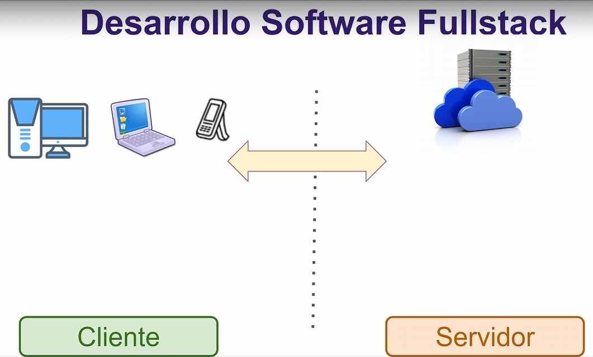

# Python con Django

Creacion de Portales Web con Django | Despliega tu proyecto onClolud

En una primera fase te ensenaremos a programar con Python desde cero, no necesitas tener conocimientos previos, tener en cuenta que todo el desarrollo se llevara a cabo en un ambiente windows, estos seran algunos de los temas que veremos en este curso:
- Sintaxis del lenguaje de programacion, creando variables, implementando condicionales, bucles, funciones
- Programacion Orientada a objetos con Python
- Manejo de Ficheros y Archivos
- Trabajar con bases de datos y Python

En una segunda parte del bootcamp te ensenaremos desde cero como crear paginas estaticas con html, css y javascript.
Y para complementar todos estos conocimientos construiremos  un proyecto web clone de Twitter.

En una tercera parte del curso nos enfocaremos en desarrollar proyectos web usando para esto el poderoso framework de Django, aqui veremos estos temas:
- Creacion de proyectos Web con Django
- Manejo de Bases de Datos y consultas
- Creacion de usuarios y manejo de roles
- Administracion de entidades y transacciones a la base de datos
- Authentication y Authorization en Django
- Publicacion y despliege de proyectros Django en servidores oncloud

## Deployment de Proyecto en Servidor onCloud

Generar paquetes Deployment Django:
- ip freeze > requirements.txt

Servidor onClolud:
- https://www.pythonanywhere.com

Para publicar el proyecto en PythonAnywhere:
- pwd => Para ver en qué dirección estás.
- git clone "La dirección de su repositorio en GitHub"
- mkvirtualenv --python=/usr/bin/python3.10 mysite-virtualenv
- cd python-django-blog
- pip install -r requirements.txt
- python manage.py collectstatic
- Configuraciones adicionales en la carpeta => **Utils/config.txt**

## Proyectos Python con Django

